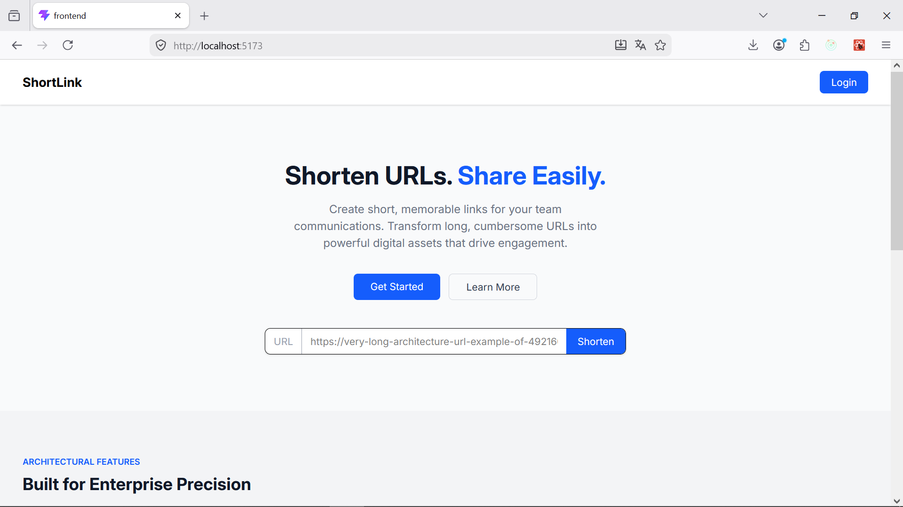
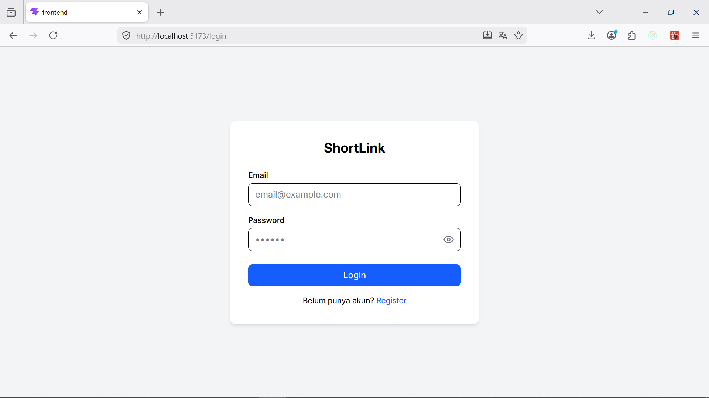
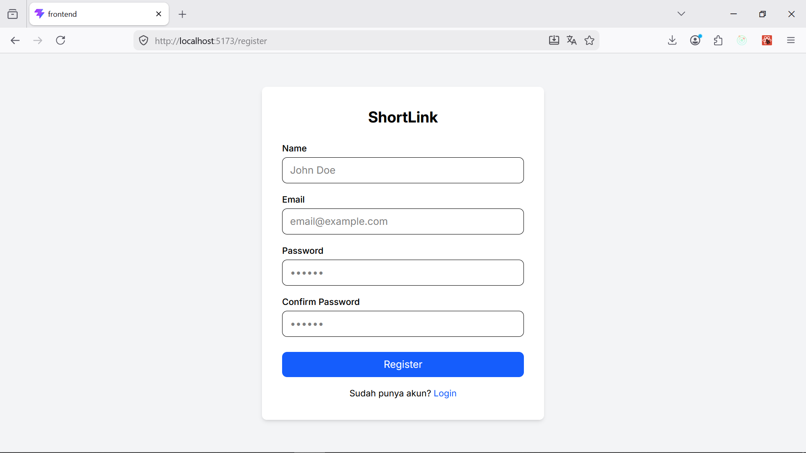
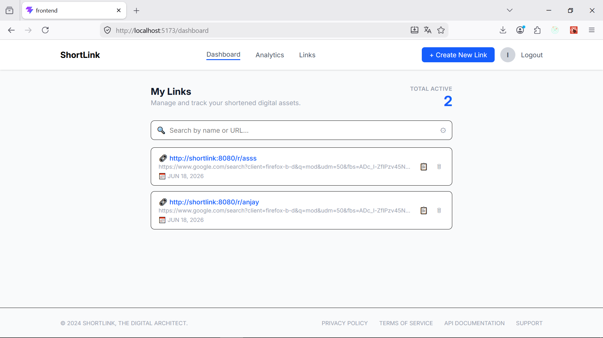
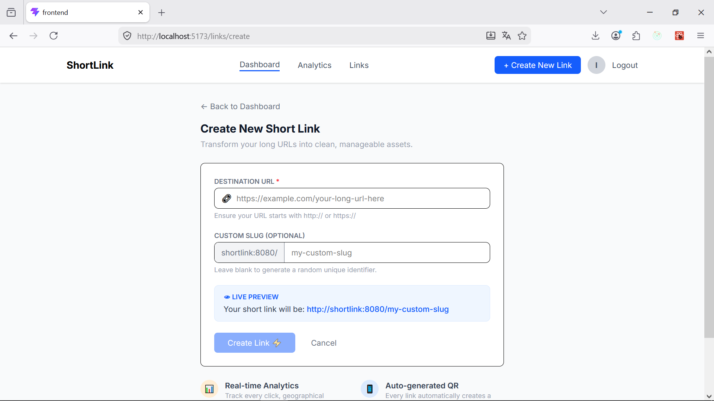
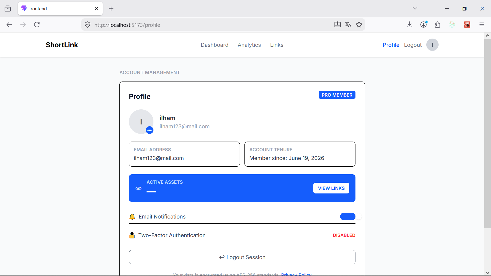
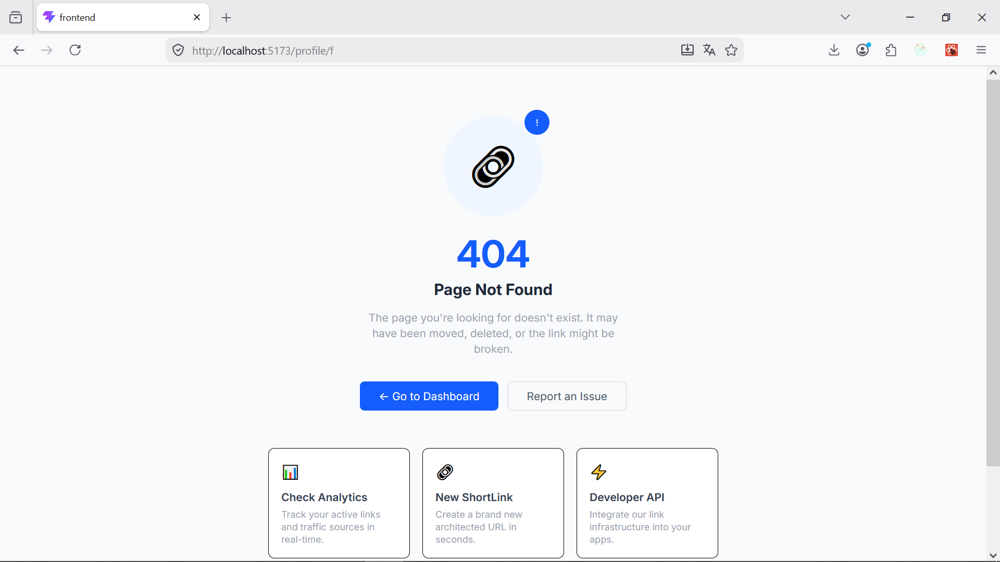

# Short Link App

A full-stack short link application built with Go, React, PostgreSQL, Redis, Docker, and Nginx.

## Preview








## Repository Overview

This repository contains:

- `backend/` : Go backend API built with Gin
- `frontend/` : React + Vite 
- `docker-compose.yml` : local deployment with Postgres, Redis, backend, frontend, and Nginx proxy
- `proxy.conf` : Nginx reverse proxy configuration for routing domain requests

## Environment Variables

For local development, all required environment variables are already configured inside `docker-compose.yml`.

Backend variables include:

- PORT
- DATABASE_URL
- REDIS_HOST
- REDIS_PORT
- SECRET_KEY
- BACKEND_URL
- FRONTEND_URL

Frontend build arguments:

- VITE_BASE_URL

No additional `.env` configuration is required for local Docker deployment.


## Clone from GitHub

1. Open a terminal.
2. Clone the repository:

```bash
git clone https://github.com/ilhammursidi/shortlink.git
```

3. Change directory into the project:

```bash
cd shortlink
```

4. Start the stack:

```bash
docker compose up --build -d
```

### API Endpoints Documentation

| Method | Endpoint | Auth Required | Description |
| :--- | :--- | :---: | :--- |
| GET | `/r/:slug` | ❌ No | Redirect short link to original destination |
| POST | `/api/auth/register` | ❌ No | Register a new user account |
| POST | `/api/auth/login` | ❌ No | Authenticate user and get access token |
| POST | `/api/links` | 🔒 Yes (JWT) | Create a new short link |
| GET | `/api/links/:user_id` | 🔒 Yes (JWT) | Get all links created by a specific user |
| DELETE | `/api/links/:id` | 🔒 Yes (JWT) | Delete a short link by its ID |
| POST | `/api/user/:id/picture` | 🔒 Yes (JWT) | Upload or update user profile picture |


## Project File Structure

```
shortlink/
├── backend/
│   ├── cmd/main.go
│   ├── db/migrations/
│   ├── internals/
│   │   ├── di/di.go
│   │   ├── routes/routes.go
│   │   ├── controller/
│   │   ├── services/
│   │   ├── repository/
│   │   ├── dto/
│   │   └── middleware/
│   ├── uploads/
│   ├── Dockerfile
│   └── .dockerignore
├── frontend/
│   ├── src/
│   ├── public/
│   ├── Dockerfile
│   ├── nginx.conf
│   └── .dockerignore
├── docker-compose.yml
├── proxy.conf
└── README.md
```

## How to Run

1. Build and start containers:

```bash
docker compose up --build -d
```

2. Open the browser:

```text
http://shortlink:8080
```

3. To stop the stack:

```bash
docker compose down
```

## Custom Domain Setup

Add the custom domain to `/etc/hosts`:

```text
127.0.0.1 shortlink
```

If you change the domain, update:

- `proxy.conf` → `server_name`
- `docker-compose.yml` → `VITE_BASE_URL`

Then rebuild the proxy/frontend services.

## Frontend Workflow

### Rebuild frontend service after code changes

```bash
docker compose up -d --build frontend
```

### Rebuild entire stack

```bash
docker compose down
docker compose up --build -d
```

### Development mode (optional)

If you want fast local frontend development:

```bash
cd frontend
npm install
npm run dev
```

Then open:

```text
http://localhost:5173
```

## Ports

- `http://shortlink:8080` → frontend via Nginx proxy
- `http://localhost:5173` → frontend direct
- `http://localhost:8888` → backend direct
- `5432` → PostgreSQL
- `6379` → Redis

## Notes

- Backend environment variables are configured in `docker-compose.yml`.
- Nginx proxy forwards `/` to frontend and `/api/` plus `/uploads/` to backend.
- `backend/uploads` is mounted for file uploads.